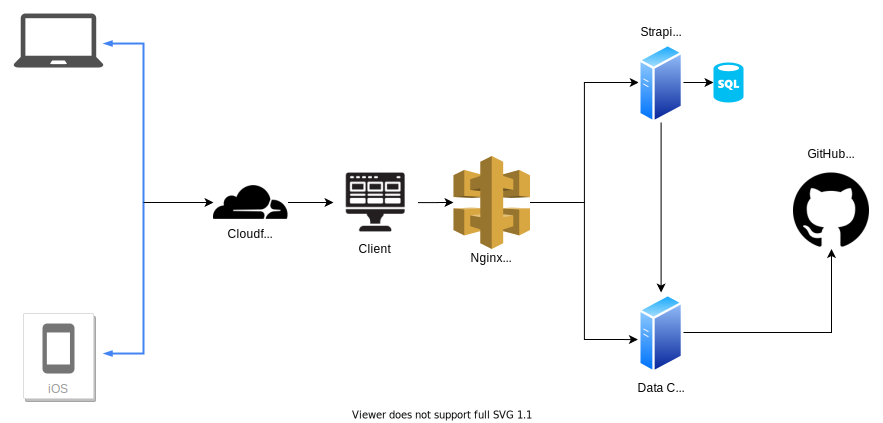
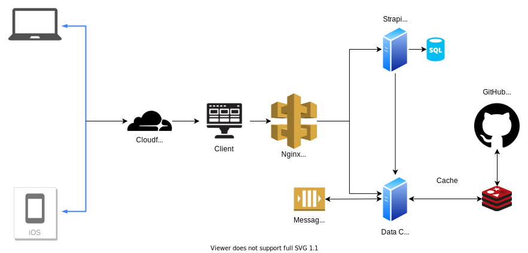

# MLH Fellowhip Contribution Report

The idea is to generate an overall report for MLH Fellowhip contributions.  
The App will generate a Markdown/PDF report which will contain

- User Info
- Repositories Contributed to 
- Pull requests made
- Commits made
- Standup notes
- Fellows collaborated with

The app will have following components
  

  

- User Service: 
    - We'll use Strapi to manage authentication/authorization.
    - Admins can add new pods and repositories the pod contributes to
    - Store user profile data
    - Will use SQLite Database (Don't want to host another Database)

- Data Collecting Service
    - Finds commits, discussion comments, PRs info of a user using GitHub Rest API
    - Returns the relevant info, i.e contributions related to the repositories the Pod maintaines

- API Gateway
    - Will use Nginx for routing request to services

- Frontend
    - VueJs Frontend, clean and simple
    - Login using GitHub
    - Generate Report

- DNS
    - Will use cloudflare DNS
    - Advantage of minified JS,CSS and Cache, less load on server

If time prmits we will add the following to App
  

  
  
- In-memory database for Caching
    - Will use Redis
    - Store user infor for 24 Hrs, so we won't have to make API requests to GitHub

- Message Queue
    - Since GitHub has limit on API requests better to maintain a message queue for requests
    - serve requests one by one
    - Use RabbitMQ
